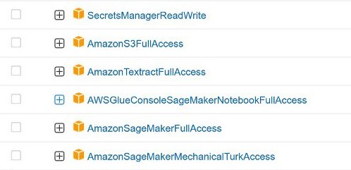

# AWS Glue TextractAnalyzeDocument

Inicie el proceso de procesamiento de documentos en AWS Glue con el servicio de aprendizaje automático integrado de Amazon Textract.

## Propósito

Casi todos los artículos muestran cómo ejecutar textract para procesar documentos en Sagemaker. Sin embargo, en el caso de que el procesamiento deba iniciarse como un proceso constante (por ejemplo, todos los días), Jupiter Notebook en una gran cantidad de datos en Sagemaker cae periódicamente -> es necesario reiniciar manualmente.
Para evitar tener que reparar constantemente un equipo portátil que no está diseñado para tal tarea, puede iniciar un proceso similar en el servicio ETL: AWS Glue.

## Lanzamiento

Aquí se omite la configuración de un entorno para procesar documentos en sagemaker. Descripción de la información detallada: https://docs.aws.amazon.com/sagemaker/latest/dg/a2i-textract-task-type.html

Una vez que se hayan agregado la política de cors y el arn del equipo de trabajo, puede proceder a configurar el trabajo en Glue.

1.  Cree un trabajo basado en Python Shell.

2.  Detalles del trabajo:
    *   Cambie el parámetro Unidades de procesamiento de datos 1/16 DPU -> 1 DPU (de lo contrario, puede aparecer MemoryError)
    *   En el guión Parámetros de trabajo, agregue `Key: --additional-python-modules, Value: sagemaker,IPython`.
        Si es necesario, agregue bibliotecas adicionales separadas por comas.
    *   Agregar un rol.

3.  Cree un rol de IAM para el trabajo.

Vaya al servicio Administración de identidades y accesos -> Roles -> Crear rol -> Política de confianza personalizada -> ...
En la ventana que aparece, inserte la siguiente configuración:

```json
{
    "Version": "2012-10-17",
    "Statement": [
        {
            "Effect": "Allow",
            "Principal": {
                "Service": [
                    "glue.amazonaws.com",
                    "sagemaker.amazonaws.com"
                ]
            },
            "Action": "sts:AssumeRole"
        }
    ]
}
```

... -> Siguiente -> Agregar permisos -> ...
Agregue las siguientes directivas:



... -> Next -> Nombre del rol -> Crear rol.

## Lecturas adicionales

El código requiere los siguientes archivos:

*   Bucket S3 con documentos a procesar.
*   Archivo CSV con los campos "doc_name, doc_path, label": el campo de etiqueta toma los valores Sí / No, donde Sí - el documento fue procesado, No - se procesará en el código en la próxima ejecución. La etiqueta de No a Sí cambia al final del sistema.
